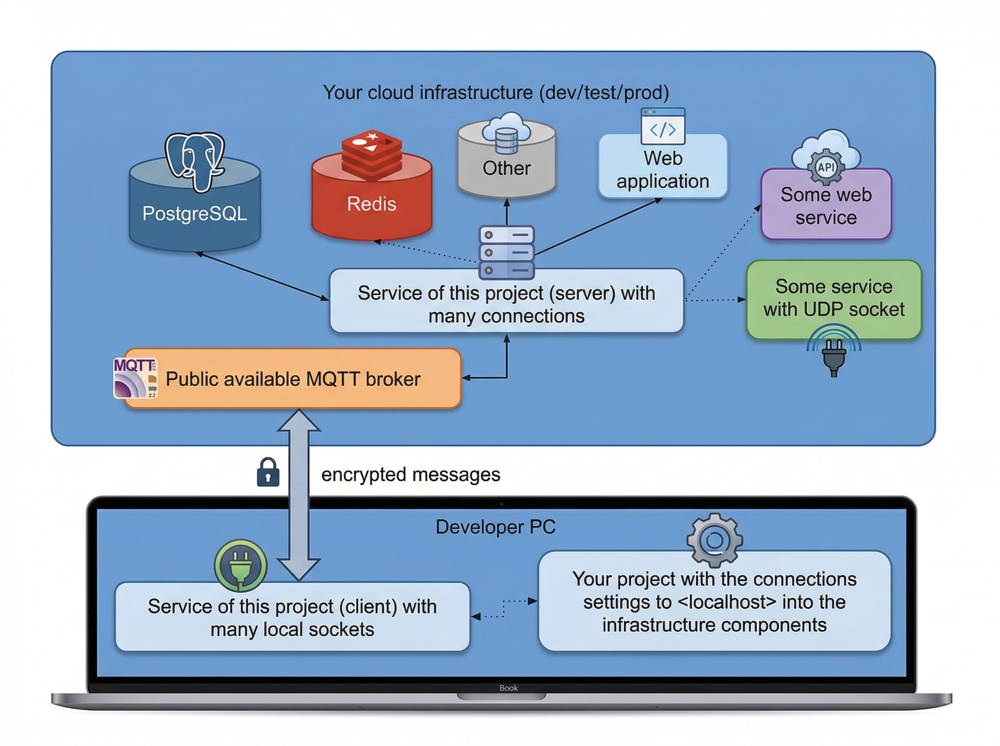

# Rust-based client-server application for forwarding TCP connections and UDP transfers via MQTT

This project enables you to create a local server for forwarding both TCP connections and UDP transfers. On the server side, it establishes persistent connections to remote destinations with encryption support. The solution delivers excellent performance and reliability. A similar [project in Python here](https://github.com/unaxfromsibiria/aiomqttbridge) uses MQTT too.
There is also a project that uses Redis Pub-Sub for traffic transmission with [Rust implementation here](https://github.com/unaxfromsibiria/connect-you-ports)

## The project can be used as a tunnel into the cloud infrastructure for development



You can forward multiple TCP and UDP connections through a message broker, launch several infrastructure services without direct access, and define named enumerations for each service: `TCP_SOCKETS='redis:127.0.0.1:6379;db:127.0.0.1:5432;dev-api:127.0.0.1:8080;rabbit:127.0.0.1:5672'` `UDP_SOCKETS='iperf-udp:0.0.0.0:9092;dns:0.0.0.0:5553'`

On the client side, all these sockets are accessible locally. On the server side, connections are established to the appropriate services based on the target configuration, e.g.: `SERVER_TCP_TARGET='redis:host-in-cloud-1:6379;db:host-in-cloud-2:5432;dev-api:host-in-cloud-3:8080;rabbit:host-in-cloud-4:5672'` and for the UDP sockets: `SERVER_UDP_TARGET='iperf-udp:0.0.0.0:9092;dns:8.8.8.8:53'`

## Configuration Features

To simplify configuration for different loads, various parameters are now grouped and set via a single environment variable `LOADING_LEVEL`.
Possible values for the variable:

- `LOADING_LEVEL=default` - or empty value, a suitable configuration for many applications
- `LOADING_LEVEL=high` - for high traffic usage or multiple clients
- `LOADING_LEVEL=extremely` - if data exchange is very intensive
- `LOADING_LEVEL=low` - if the client or server is running on very limited resources

Additionally, you may need to configure the following to optimize for your specific services:

- `WORKERS=8` - should be increased if there are many targets or clients
- `KEEP_CONNECTION=true` - try to handle next operation after read/write errors, it is better option for several network services
- `READ_BUFFER_SIZE=16384` - read buffer size; sometimes it needs to be specified manually (a manually set value overrides the one determined by `LOADING_LEVEL`)
- `RUST_LOG=warning` - set this if you don't need extensive logging

Some services work better with a buffer larger than 8kb, while others prefer 2kb. It is recommended to experiment with this parameter.

Other configurations are available as examples below.

## Example using Docker

To set up the server side:

```bash
make example_server -s
# edit compose file to set env variables
docker compose up -d --build
```

and client side almost the same way:

```bash
make example_client -s
# edit compose file to set env variables
docker compose up -d --build
```

## Quick start

Copy and launch script:

```bash
wget -O update_connect_ports.sh https://raw.githubusercontent.com/unaxfromsibiria/connect-you-ports-mq/refs/heads/main/scripts/update_fast.sh && chmod 770 update_connect_ports.sh && ./update_connect_ports.sh
```

Go to project:

```bash
cd connect-you-ports-mq-main
make example_server
```

You can run the script to update the code version later.
